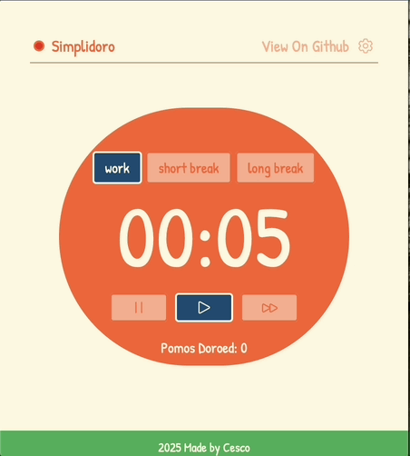
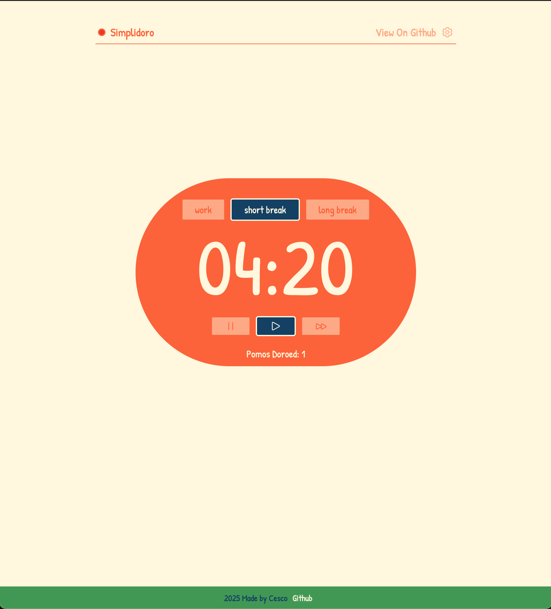
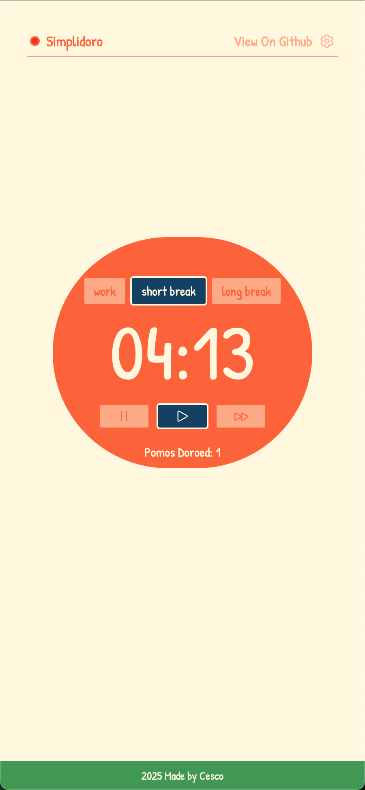
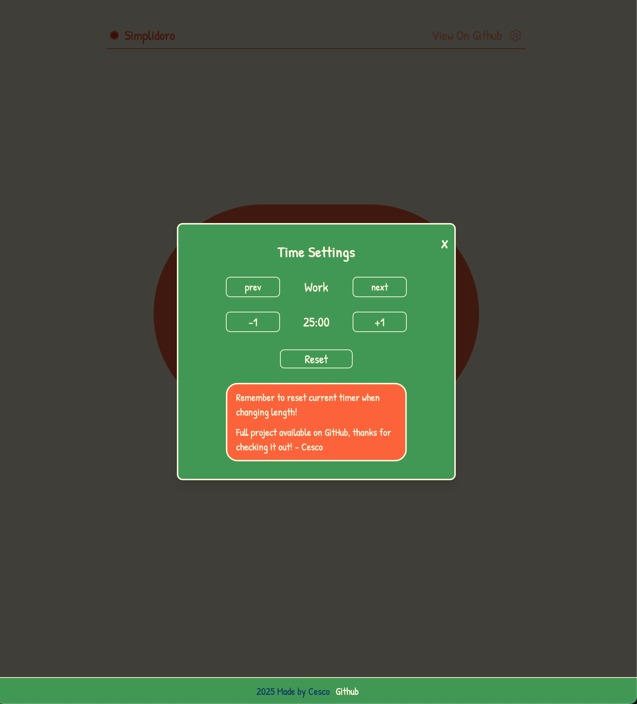
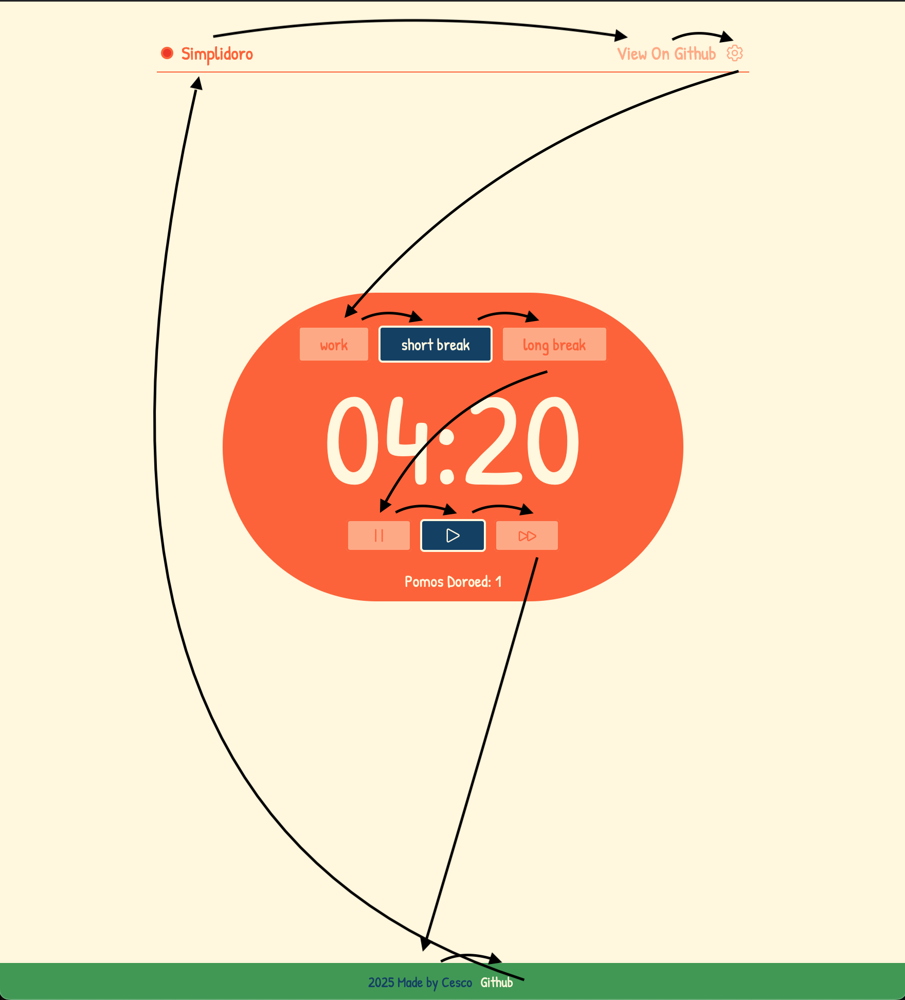

# Simplidoro (no frills pomodoro timer)

This is my minimalist reddit client called Newitt based on the mockup and [project from roadmap.sh](https://roadmap.sh/projects/reddit-client). This browser-based reddit client loads the newest content from
a predefined group of subreddits or individually selected subreddits into individual, responsive and dynamic lanes. 
<br>
<br>
Live Demo: coming soon!

## How it was made:

**Tech used:** 
- Framework: React
- Build Tool: Vite
- Styling: TailwindCSS, CSS
- State Management: Jotai
- Other: 
  - Aseprite for logo design
  - HeroIcons for pause, play, forward, gear icons
  - Google fonts for Patrick Hand font

## Visual Examples
<br> Demo <br>



<br> Desktop View <br>



<br> Mobile View <br>



<br> The Modal <br>



<br> Keyboard control flow map <br>



## How To Run The Project

1. Download or clone the repo onto your local environment, and navigate into the folder
```
git clone https://github.com/cescosgames/simplidoro.git
cd simplidoro
```
2. Install dependencies
```
npm install
```
3. Run the dev server
```
npm run dev
```
4. Go to your selected local host in your browser (Vite default is 5173)

## Features:

Following the project guidelines, this project features...
1. User ability to start, stop, and resume a pomodoro timer
2. User ability to configure the default session intervals to their liking, and reset to defaults
3. Automatic work flow of work session -> short break -> work session... until every 4th successful work session where short break is skipped, and long break is started instead
4. Clear visual feedback of current work session and tracking of succesful work sessions
5. Audio notification upon completion of work session, as well as visual feedback anyone hearing impaired or who does not want volume
6. Responsive on mobile and desktop
7. Intuitive keyboard only navigation with descriptive aria-labels on important components
8. 'Focus Trap' modal for easy keyboard navigation of the modal
9. Whole site can be quickly controlled and managed using just they keyboard
10. Intentionally designed with a 'cozy vegetable' theme to deliver thematically and functionally consistent design

## Lessons Learned:

Another bigger project and this was one provided it's own unique challenges! Funny enough, the timer itself was completed rather quickly, but the other project outline notes
gave me pause to think of the best approach. This project really helped me practice accessibility as I used my screen reader and keyboard to try and manage the whole project.
Designing with a screen reader and keyboard navigation in mind was definitely a new approach for me and, as this is a relatively small project, it was great practice. Trapping
the modal and making everything just a simple button click was a fun design challenge. I also appreciated the design aspect of this project as no guidelines or reference images
were provided, allowing me to approach the project in the way I best saw fit. In the end, the goal was to make a productivity assistant named after a vegetable, so styling it in 
a supportive way to encourage productivity using warm vegetable colors seemed like the best approach.
<br>
This was also the first project where I really tried to implement intentional state management using Jotai, and while I know I can improve on my approach, overall I am happy with 
my first attempt at global state management. I believe that I hit all the technical requirements (using a frontend framework, implementing state management, modular and reusable
code structure, accessibility standards.)
<br>
I would say my weakest point in this project is probably the modular and reusable code structure. Specifically, I didn't break down the 'time control' buttons into their own
components, for no real justifiable reason. If I were to revisit this project that would be my first correction. The main timer itself also got a bit messy with the amount of
functions and variables it ended up holding, so cleaning that up could improve the project. Overall though, with the thorough commenting throughout the project, I believe any 
one could take a look and understand and change the project as they see fit.
<br>
Thanks for checking out this project! Please feel free to reach out for any comments/question/critiques, I'm always looking to improve!